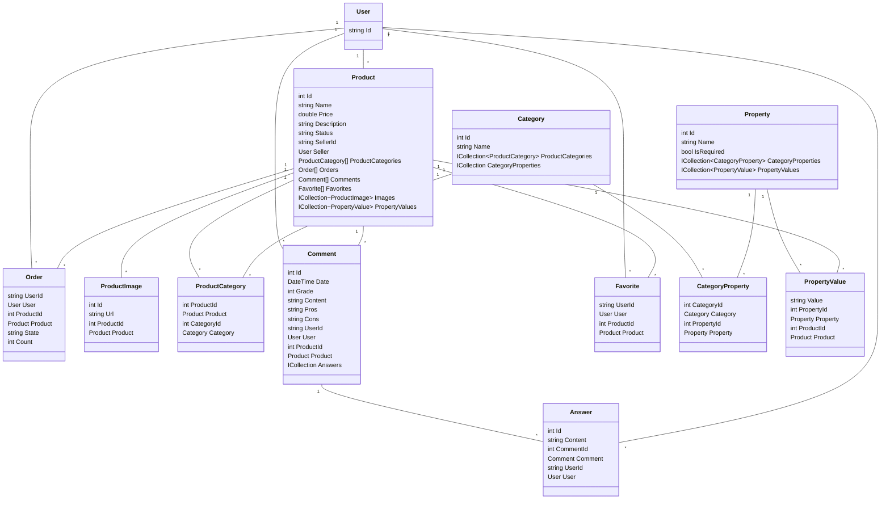

```mermaid
classDiagram
  class User {
    string Id

  } 

  User "1" -- "*" Order
  Product "1" -- "*" Order
  class Order {
    string UserId 
    User User

    int ProductId
    Product Product

    string State
    int Count
  }

  User "1" -- "*" Product
  class Product {
    int Id
    string Name
    double Price
    string Description
    string Status

    string SellerId
    User Seller

    ProductCategory[] ProductCategories 
    Order[] Orders 
    Comment[] Comments
    Favorite[] Favorites
    ICollection~ProductImage> Images 
    ICollection~PropertyValue> PropertyValues
  } 

  Product "1" -- "*" ProductImage
  class ProductImage {
    int Id
    string Url

    int ProductId 
    Product Product 
  }

  Product "1" -- "*" ProductCategory
  Category "1" -- "*" ProductCategory
  class ProductCategory {
    int ProductId
    Product Product

    int CategoryId
    Category Category
  }

  class Category {
    int Id 
    string Name 

    ICollection~ProductCategory~ ProductCategories 
    ICollection<CategoryProperty> CategoryProperties
  }

  User "1" -- "*" Comment
  Product "1" -- "*" Comment
  class Comment {
    int Id
    DateTime Date
    int Grade
    string Content
    string Pros
    string Cons

    string UserId
    User User

    int ProductId
    Product Product

    ICollection<Answer> Answers
  }

  Comment "1" -- "*" Answer
  User "1" -- "*" Answer
  class Answer {
    int Id
    string Content

    int CommentId
    Comment Comment

    string UserId
    User User
  }

  User "1" -- "*" Favorite
  Product "1" -- "*" Favorite
  class Favorite {
    string UserId
    User User

    int ProductId
    Product Product
  }

  Category "1" -- "*" CategoryProperty
  Property "1" -- "*" CategoryProperty
  class CategoryProperty {
    int CategoryId
    Category Category

    int PropertyId
    Property Property
  }

  class Property {
    int Id
    string Name
    bool IsRequired

    ICollection~CategoryProperty~ CategoryProperties
    ICollection~PropertyValue~ PropertyValues
  }

  Property "1" -- "*" PropertyValue
  Product "1" -- "*" PropertyValue
  class PropertyValue {
    string Value

    int PropertyId
    Property Property

    int ProductId
    Product Product
  }
```